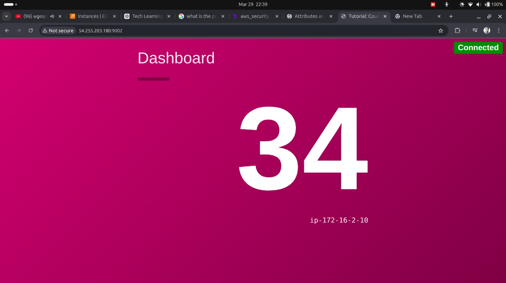

# Dashboard Counting App - Terraform Deployment

This Terraform configuration deploys a simple dashboard counting application on AWS. The infrastructure is built from scratch without using any pre-built modules.

## Architecture

The deployment creates the following AWS resources:

- **VPC**: A single Virtual Private Cloud in the `ap-southeast-1` region
- **Subnets**:
  - 1 Public subnet (in availability zone `ap-southeast-1a`)
  - 1 Private subnet (in availability zone `ap-southeast-1b`)
- **Internet Gateway (IGW)**: Attached to the VPC for public internet access
- **NAT Gateway**: With an Elastic IP, attached to the public subnet for private subnet outbound traffic
- **EC2 Instances**:
  - Public instance: Runs the dashboard service
  - Private instance: Runs the counting service
- **Security Groups**:
  - Public SG: Allows HTTP (port 80) and SSH (port 22) access
  - Private SG: Allows traffic from the dashboard instance on required ports

## Services

- **Dashboard Service**: Runs on the public EC2 instance via systemd. Accessible via HTTP.
- **Counting Service**: Runs on the private EC2 instance via systemd. Communicated with by the dashboard service.

## Prerequisites

- AWS CLI configured with appropriate credentials
- Terraform v1.x installed
- SSH key pair for EC2 access

## Deployment

1. Initialize Terraform:
   ```bash
   terraform init
   ```

2. Review the plan:
   ```bash
   terraform plan
   ```

3. Apply the configuration:
   ```bash
   terraform apply
   ```

## Usage

After deployment:

1. Get the public IP of the dashboard instance from Terraform outputs
2. Access the dashboard via `http://<public-ip>`
3. The dashboard will communicate with the counting service internally

## Cleanup

To destroy the infrastructure:
```bash
terraform destroy
```

## Notes

- Security groups are configured to allow only necessary ports
- The private instance is not directly accessible from the internet
- All resources are tagged appropriately

## Dashboard UI

The dashboard service is reachable from the public IP on port `9002`.



## Architecture Diagram

