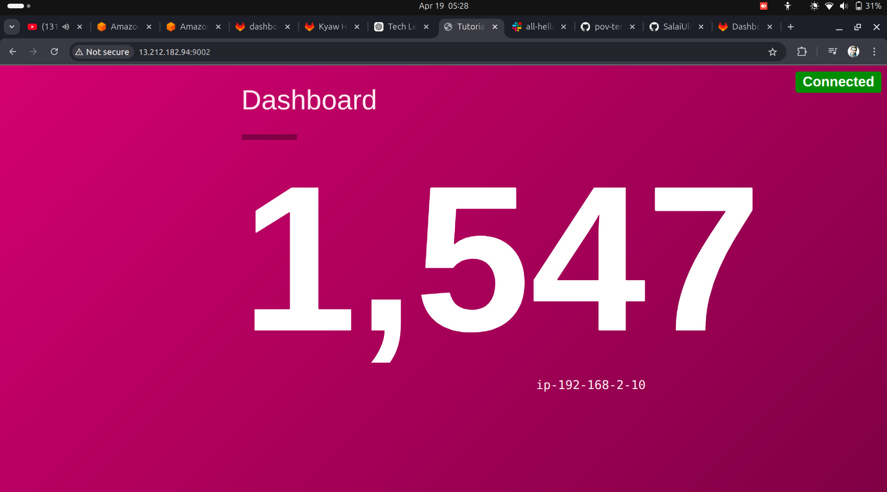

# Dashboard-Counting-App V1 (Terraform with AWS Public Modules)

## Overview

This project provisions a simple two-tier application on AWS using **Terraform** and **public modules**.
It deploys a **Dashboard service** that communicates with a **Counting service** over a private network inside a VPC.

---

## Architecture

* **VPC**
* **Public Subnets**
* **Internet Gateway**
* **Route Tables & Associations**
* **Security Groups**
* **EC2 Instances**

  * Dashboard Instance (Frontend/API)
  * Counting Instance (Backend API)
* **SSH Key Pair (local ssh-keygen)**

### Traffic Flow

```
Browser → Dashboard (Public IP:9002)
Dashboard → Counting (Private IP:9003)
```

---

## Tech Stack

* Terraform
* AWS (EC2, VPC, Security Groups)
* Terraform AWS Public Modules
* Linux (Amazon Linux / Ubuntu)
* systemd services

---

## Project Structure

```
dashboard-counting-app-v1-assignment/
├── vpc.tf
├── security_group.tf
├── ec2-instance.tf
├── key-pair.tf
├── variables.tf
├── terraform.tfvars
├── versions.tf
├── README.md
```

---

## Modules Used

* VPC module
* Security Group module
* EC2 Instance module

These modules are sourced from **Terraform public registry** and wired together in the root module.

---

## Key Features

* Uses **public Terraform modules** instead of raw resources
* Secure communication:

  * Dashboard → Counting via **private IP**
* SSH access configured using **local ssh-keygen key pair**
* Services managed using **systemd**
* Clean separation of:

  * Networking
  * Security
  * Compute

---

## Setup Instructions

### 1. Initialize Terraform

```bash
terraform init
```

### 2. Validate configuration

```bash
terraform validate
```

### 3. Plan infrastructure

```bash
terraform plan
```

### 4. Apply infrastructure

```bash
terraform apply
```

---

## Access Application

After deployment:

```
http://<dashboard-public-ip>:9002
```

---

## Security Notes

* Only required ports are opened:

  * `22` (SSH)
  * `9002` (Dashboard)
  * `9003` (Counting, internal only)
* Counting service is **not publicly exposed**
* Private key is **not committed to repository**

---

## .gitignore

This project excludes:

```
.terraform/
*.tfstate
*.tfstate.backup
*.pem
*.key
```

---

## Dashboard UI

The dashboard service is reachable from the public IP on port `9002`.



---

## Improvements (Future Work)

* Convert to full **modular Terraform structure**
* Add **Load Balancer (ALB)**
* Enable **HTTPS (TLS)**
* Move instances to **private subnets + NAT Gateway**
* Add **Auto Scaling Group**
* Integrate **CI/CD pipeline**

---

## Author

Salai Ulric

---

## Architecture Flow

